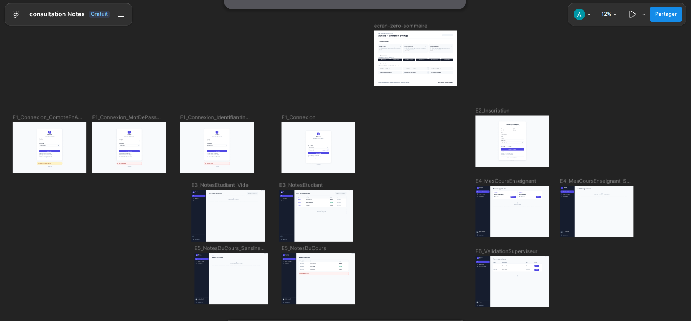

# Consultations-Notes
# Consultation de notes — application trois-tiers

DEV 1 — Année 2025–2026 — Binôme : Akrame · Clement

Application web de consultation de notes en trois couches séparées (présentation, métier en Python, base de données relationnelle), prototypée sous Figma.

## Prototype Figma

Lien (lecture seule) : https://www.figma.com/design/NkejS9EXwWhCadP08SjIXK/consultation-Notes?node-id=0-1&t=FOR3aEmyLQMVxY5h-1



Parcours : étudiant E1 → E3 ; enseignant E1 → E4 → E5 ; superviseur E1 → E6.

## Documentation

- [Dossier d'analyse](docs/analyse.md)
- [Tableau de tests d'intégration (étape 6)](docs/tests.md)
- [Procédure d'installation sur machine vierge](docs/installation.md)

## Avancement

| Étape | Statut |
|---|---|
| 1. Analyse | fait |
| 2. Prototype Figma | fait |
| 3. Couche données | fait |
| 4. Couche métier | fait |
| 5. Couche présentation | fait |
| 6. Intégration et tests | fait (captures à ajouter dans `docs/captures/`) |

## Lancer la couche métier (étape 4)

Pré-requis : PostgreSQL avec la base peuplée (scripts de `donnees/`) et Python 3.10 ou plus.

```bash
cd metier
python3 -m venv .venv
source .venv/bin/activate
pip install -r requirements.txt
cp .env.example .env # puis adapter les valeurs si besoin
set -a; source .env; set +a
python -m app.main # l'API écoute sur http://127.0.0.1:5000
```

Dans un second terminal (base peuplée et API lancée) : `bash exemples_requetes.sh` rejoue les requêtes curl des six routes et affiche le code HTTP de chacune.

## Lancer le client (étape 5)

Le client est un ensemble de pages HTML + JavaScript sans framework (dossier `client/`). Il ne parle qu'à l'API. L'adresse de l'API est réglée dans un seul fichier, `client/config.js`.

Avec l'API déjà lancée (voir ci-dessus), dans un autre terminal :

```bash
cd client
python3 -m http.server 8080
```

Puis ouvrir http://localhost:8080 dans le navigateur. Comptes de démonstration (mot de passe `motdepasse123`) : `lmartin` (étudiant), `sbenali` (enseignant), `admin` (superviseur).

## Tests et installation (étape 6)

Le tableau de tests ([`docs/tests.md`](docs/tests.md)) couvre les 25 requêtes de l'API, les parcours du client dans le navigateur, et le test demandé par le sujet vérifiant qu'un étudiant ne peut pas voir les notes d'un autre. La procédure d'installation sur une machine vierge ([`docs/installation.md`](docs/installation.md)) a été suivie et vérifiée sur une machine n'ayant rien d'installé pour ce projet.

## Organisation prévue du dépôt

- `client/` : couche présentation
- `metier/` : couche métier (Python)
- `donnees/` : scripts SQL
- `docs/` : analyse, prototype, tests et procédure d'installation
